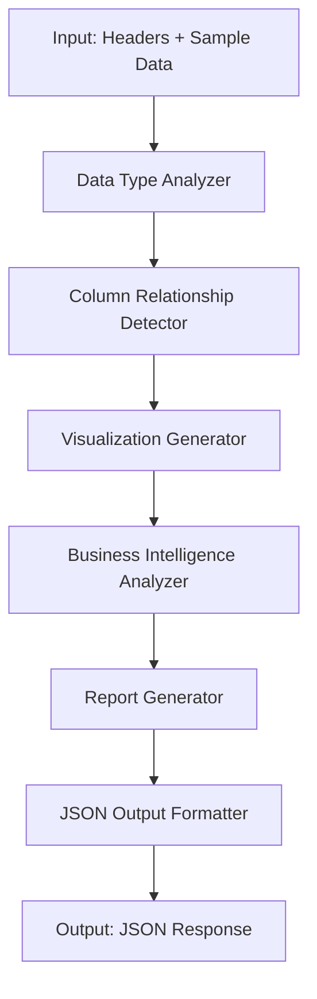

# Design Document - Senior Data Analyst AI

## Overview

The Senior Data Analyst AI is a comprehensive automated exploratory data analysis system that transforms raw dataset information into actionable insights and visualization recommendations. The system operates as a single-function analyzer that takes dataset headers and sample data as input and produces a structured JSON response containing both visualization specifications and detailed business intelligence reports.

The core design philosophy centers on maximizing analytical coverage - generating every possible meaningful visualization until no more unique charts can be created, while maintaining focus on business-relevant insights and actionable recommendations.

## Architecture

### High-Level Architecture



### System Flow

1. **Input Processing**: Validate and parse dataset headers and sample data
2. **Data Analysis**: Analyze column types, relationships, and patterns
3. **Visualization Generation**: Create all possible unique chart recommendations
4. **Business Intelligence**: Generate comprehensive analysis report
5. **Output Formatting**: Structure results into specified JSON format

## Components and Interfaces

### 1. Input Processor

**Purpose**: Validates and normalizes input data structure

**Interface**:
```typescript
interface InputData {
  headers: string[];
  sampleData: any[][];
}

interface ProcessedInput {
  columns: ColumnInfo[];
  dataQuality: DataQualityMetrics;
}
```

**Responsibilities**:
- Validate input format and structure
- Detect column data types from sample data
- Identify data quality issues
- Normalize column names and data formats

### 2. Data Type Analyzer

**Purpose**: Analyzes column characteristics and relationships

**Interface**:
```typescript
interface ColumnInfo {
  name: string;
  type: 'numerical' | 'categorical' | 'datetime' | 'text';
  uniqueValues?: number;
  hasNulls: boolean;
  sampleValues: any[];
}

interface DataQualityMetrics {
  completeness: number;
  consistency: number;
  issues: string[];
}
```

**Responsibilities**:
- Classify column data types
- Calculate basic statistics
- Identify potential relationships between columns
- Detect data quality issues

### 3. Visualization Generator

**Purpose**: Creates all possible unique visualization recommendations

**Interface**:
```typescript
interface ChartRecommendation {
  title: string;
  type: 'bar' | 'line' | 'scatter';
  xAxis: string;
  yAxis: string;
}
```

**Responsibilities**:
- Generate bar charts for categorical-vs-numeric analysis
- Create line charts for time-series and trend analysis
- Produce scatter plots for numerical correlations
- Ensure no duplicate visualizations
- Maximize chart diversity and coverage

### 4. Business Intelligence Analyzer

**Purpose**: Generates comprehensive business context and insights

**Interface**:
```typescript
interface BusinessInsights {
  industryDomain: string;
  primaryValueColumns: string[];
  potentialCorrelations: string[];
  actionableQuestions: string[];
  datasetPotential: string;
}
```

**Responsibilities**:
- Identify likely industry/domain context
- Detect primary value-driving columns
- Suggest potential correlations and patterns
- Generate actionable business questions
- Assess overall dataset analytical potential

### 5. Report Generator

**Purpose**: Creates structured Markdown analysis report

**Responsibilities**:
- Format executive summary with industry context
- Document statistical analysis findings
- Present relationship insights
- List actionable business questions
- Provide dataset potential assessment

### 6. Output Formatter

**Purpose**: Structures final JSON response

**Interface**:
```typescript
interface AnalysisOutput {
  charts_to_generate: ChartRecommendation[];
  full_analysis_report_markdown: string;
}
```

## Data Models

### Core Data Structures

```typescript
// Input data structure
interface DatasetInput {
  headers: string[];
  sampleData: any[][];
}

// Internal column analysis
interface ColumnAnalysis {
  name: string;
  dataType: DataType;
  statistics: ColumnStatistics;
  relationships: RelationshipInfo[];
}

// Chart generation model
interface ChartSpec {
  title: string;
  type: ChartType;
  xAxis: string;
  yAxis: string;
  rationale: string;
}

// Business analysis model
interface BusinessAnalysis {
  executiveSummary: string;
  statisticalFindings: string[];
  relationshipInsights: string[];
  actionableQuestions: string[];
  conclusion: string;
}
```

### Chart Generation Logic

The visualization generator follows a systematic approach:

1. **Categorical-Numeric Combinations**: Generate bar charts for all meaningful categorical vs numeric column pairs
2. **Time-Series Analysis**: Create line charts for datetime columns against numeric values
3. **Correlation Analysis**: Produce scatter plots for all numeric column combinations
4. **Distribution Analysis**: Generate appropriate charts for single-column distributions
5. **Composition Analysis**: Create charts showing part-to-whole relationships

## Error Handling

### Input Validation Errors
- Invalid JSON format
- Missing required fields (headers, sampleData)
- Empty or malformed data arrays
- Inconsistent data structure

### Processing Errors
- Insufficient data for analysis
- Unrecognizable data types
- Memory limitations for large datasets
- Timeout for complex analysis

### Error Response Format
```json
{
  "error": true,
  "message": "Descriptive error message",
  "code": "ERROR_CODE",
  "suggestions": ["Actionable suggestion 1", "Actionable suggestion 2"]
}
```

## Testing Strategy

### Unit Testing
- **Input Processor**: Test validation logic with various input formats
- **Data Type Analyzer**: Verify correct type detection and statistics calculation
- **Visualization Generator**: Ensure all chart types are generated appropriately
- **Business Intelligence Analyzer**: Test insight generation accuracy
- **Report Generator**: Validate Markdown formatting and content structure

### Integration Testing
- **End-to-End Flow**: Test complete pipeline with various dataset types
- **Output Format Validation**: Ensure JSON structure compliance
- **Chart Generation Coverage**: Verify maximum unique chart generation
- **Business Insight Quality**: Test relevance and actionability of insights

### Test Data Sets
- **Financial Data**: Stock prices, revenue, expenses
- **Sales Data**: Customer demographics, purchase history, product performance
- **Operational Data**: Time-series metrics, categorical groupings
- **Mixed Data Types**: Combination of numerical, categorical, and datetime columns

### Performance Testing
- **Large Dataset Handling**: Test with datasets of varying sizes
- **Chart Generation Limits**: Verify system behavior at maximum chart capacity
- **Memory Usage**: Monitor resource consumption during analysis
- **Response Time**: Ensure reasonable processing times for typical datasets

## Security Considerations

### Data Privacy
- No persistent storage of input data
- In-memory processing only
- Automatic cleanup of processed data

### Input Sanitization
- Validate all input parameters
- Prevent injection attacks through data content
- Limit input size to prevent resource exhaustion

### Output Security
- Sanitize generated content in reports
- Prevent information leakage through error messages
- Validate JSON structure before output